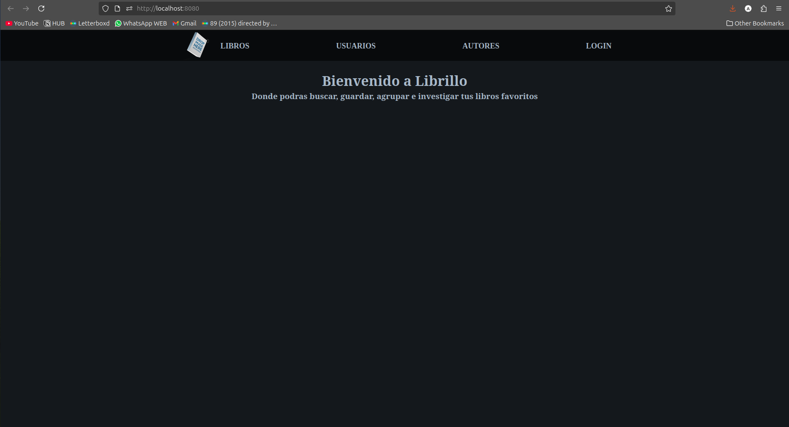
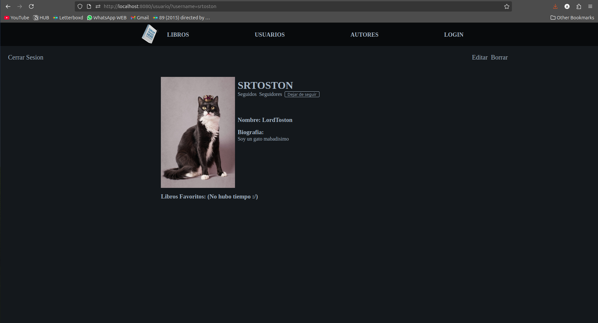

LIBRILLO

El proyecto es una pagina web que permite a los usuarios ver, crear, editar y eliminar distintos libros y autores.

Además, cada usuario cuenta con la posibilidad de:
1. Crear un usuario
2. Editar su usuario
3. Eliminar su usuario
4. Ver y seguir los perfiles de otros usuarios

COMO CORRER:

1. Clona el repositorio en tu maquina local.
2. Correr en la terminal "npm install" para poder instalar todas las dependencias.
3. Hay dos opciones para crear los contenedores del back y del front
    Usando docker:
        1. Para iniciar toda la aplicacion puedes usar "docker compose up -d"
        2. A su vez, tanto el backend como el frontend pueden ser levantados por separado simplemente añadiendo "frontend" o  "backend" al final del comando anterior
        3. Para cerrar el contenedor solo debe ejecutar "docker compose down"
        4. Para reiniciar la base de datos se puede ejecutar "docker compose down --volumes"

    Usando make:
        1. Se puede iniciar la aplicacion ejecutando "make app" o "make app_d", la segunda para modo detatched.
        2. Se puede iniciar tanto el backend como el frontend ejecutando "make back" o "make front", ambos teniendo su variacion con "_d"
        3. Para detener la app se puede usar "make stop_app", esto tambien funciona con "stop_back" y "stop_front"
        4. Para reiniciar la base de datos ejecutar "make delete_db"
        5. Finalmente, si desea acceder a la base de datos directamente dentro del contenedor, puede ejecutar "make acceder_db"

